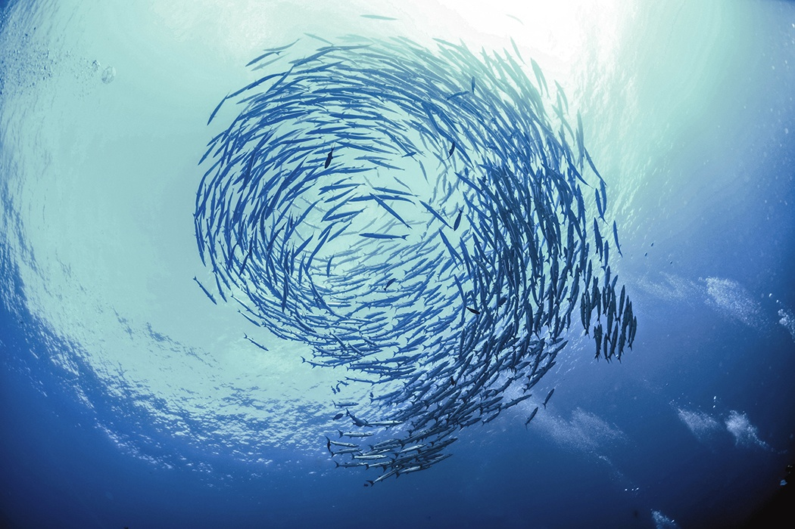

## About the Data 
- 35 Countries surveyed on fish caught in 2006-2014
- Going to look at comparisons between each country
- Also looking at one country throughout the years
{width=80%,height=70%}

## Data Collected
-Packages used:

```{r}
library(tidyverse)
library(dplyr)
```


## Raw Data


```{r}
all_data<-read.csv("Raw_Data/fish_catches.csv")
head(all_data)
```


## Total catch in 2006, 2010 and 2014

```{r, echo=FALSE}
total_catch<-read.csv("Clean_Data/Total_catch.csv")
head(total_catch)
```
```{r, echo=FALSE}
total_catch_long<-gather(total_catch,year, counts, -Country)
head(total_catch_long)
```
- Made year and counts their own column

## Histogram of Countries
```{r, echo=FALSE}
ggplot(total_catch_long, aes(year,counts))+
  geom_bar(aes(fill=Country),stat="identity",position="dodge")+
  labs(x="Year")
```
***
- NO (Norawy) had the biggest change
- RU, SE, and UK had the smallest change


## Belgium Fish Catches from 2006-2014

```{r,echo=FALSE}
fish_catch<-read.csv("Clean_Data/BelgiumCatch.csv")
head(fish_catch)
```
{width=65%,height=65%}


## Manipulation of Data for Belgium Catches

```{r, warning=FALSE}
BEdata<- fish_catch %>%
  gather(year, count, X2014:X2013:X2012:X2011:X2010:X2009:X2008:X2007:X2006)
BEdataframe<-data.frame(BEdata)
BE_catch<-BEdata%>%
  select(year,count)
new_BE<-BE_catch%>%
  group_by(year)%>%
  summarize(count=sum(count))
new_BE
```


## Total Fish Catches per Year

```{r, echo=FALSE}
ggplot(new_BE)+
  geom_point(aes(year,count),color="orange")+
  labs(y="total count")
```
***
- Geneal increase of fish catches

## World Map

{width=90%}

## Norway Fish catches

```{r, echo=FALSE}
NO<-all_data%>%
  filter(Country=="NO")%>%
  select(X2014,X2013,X2012,X2011,X2010,X2009,X2008,X2007,X2006)
longNO<-gather(NO)
NO_by_year<-matrix(c(2014, sum(NO$X2014),
       2013, sum(NO$X2013),
       2012, sum(NO$X2012),
       2011, sum(NO$X2011),
       2010, sum(NO$X2010),
       2009, sum(NO$X2009),
       2008, sum(NO$X2008),
       2007, sum(NO$X2007),
       2006, sum(NO$X2006)), nrow=9, ncol=2,byrow=TRUE) 
colnames(NO_by_year)<-c("year","count")
NO_data<-data.frame(NO_by_year)
ggplot(NO_data)+
  geom_point(aes(year,count),color="purple")+
  labs(y="total count")
```


## Russia Fish Catches

```{r, echo=FALSE}
RU<-all_data%>%
  filter(Country=="RU")%>%
  select(X2014,X2013,X2012,X2011,X2010,X2009,X2008,X2007,X2006)
longRU<-gather(RU)
RU_by_year<-matrix(c(2014, sum(RU$X2014),
       2013, sum(RU$X2013),
       2012, sum(RU$X2012),
       2011, sum(RU$X2011),
       2010, sum(RU$X2010),
       2009, sum(RU$X2009),
       2008, sum(RU$X2008),
       2007, sum(RU$X2007),
       2006, sum(RU$X2006)), nrow=9, ncol=2,byrow=TRUE) 
colnames(RU_by_year)<-c("year","count")
RU_data<-data.frame(RU_by_year)
ggplot(RU_data)+
  geom_point(aes(year,count), color="hot pink")+
  labs(y="total count")
```


## SE Fish catches

```{r, echo=FALSE}
SE<-all_data%>%
  filter(Country=="SE")%>%
  select(X2014,X2013,X2012,X2011,X2010,X2009,X2008,X2007,X2006)
longSE<-gather(SE)
SE_by_year<-matrix(c(2014, sum(SE$X2014),
       2013, sum(SE$X2013),
       2012, sum(SE$X2012),
       2011, sum(SE$X2011),
       2010, sum(SE$X2010),
       2009, sum(SE$X2009),
       2008, sum(SE$X2008),
       2007, sum(SE$X2007),
       2006, sum(SE$X2006)), nrow=9, ncol=2,byrow=TRUE) 
colnames(SE_by_year)<-c("year","count")
SE_data<-data.frame(SE_by_year)
ggplot(SE_data)+
  geom_point(aes(year,count),color="magenta")+
  labs(y="total count")
```


## UK Fish catches

```{r, echo=FALSE}
UK<-all_data%>%
  filter(Country=="UK")%>%
  select(X2014,X2013,X2012,X2011,X2010,X2009,X2008,X2007,X2006)
longUK<-gather(UK)
UK_by_year<-matrix(c(2014, sum(UK$X2014),
       2013, sum(UK$X2013),
       2012, sum(UK$X2012),
       2011, sum(UK$X2011),
       2010, sum(UK$X2010),
       2009, sum(UK$X2009),
       2008, sum(UK$X2008),
       2007, sum(UK$X2007),
       2006, sum(UK$X2006)), nrow=9, ncol=2,byrow=TRUE) 
colnames(UK_by_year)<-c("year","count")
UK_data<-data.frame(UK_by_year)
ggplot(UK_data)+
  geom_point(aes(year,count),color="salmon")+
  labs(y="total count")
```


## Scatter Plot for all countries
```{r,echo=FALSE,warning=FALSE}
data<-all_data%>%
  select(Country,X2014,X2013,X2012,X2011,X2010,X2009,X2008,X2007,X2006)
long_data<-gather(data, year, counts, -Country)
ggplot(long_data)+
  geom_point(aes(x=year,y=counts,color=Country))+
  facet_wrap(~Country)
```


## Conclusion
- Generally, an overall decreae in fish catches
- Some countries change more rapidly than others


